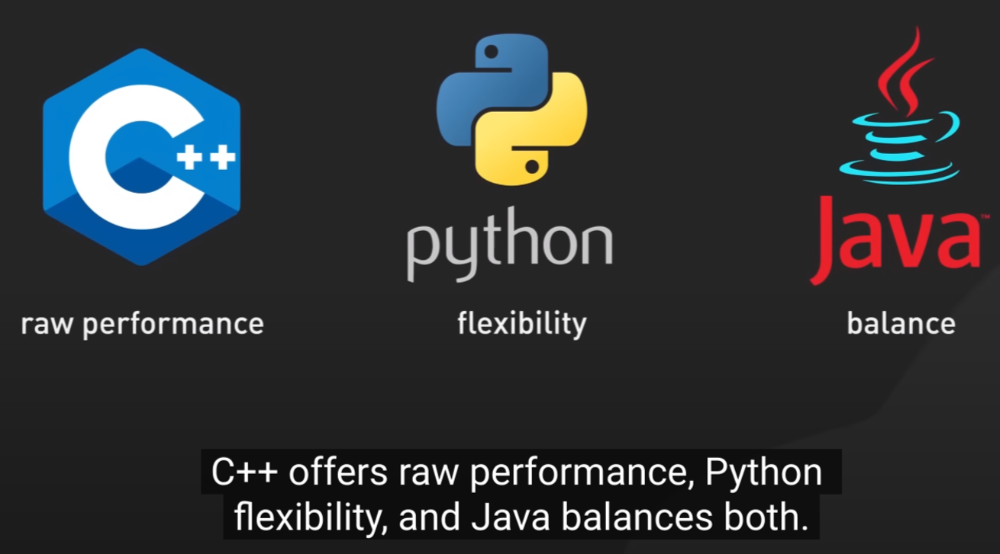

# Java cheat sheet

## How Java is different from JavaScript?

Java is a **statically typed language**. Meaning declaring variables in Java is much more strict than in JavaScript. You have to explicitly declare what type of variable you are creating in Java.

In order to do anything in Java, you must use **utilize classes**. Classes are reusable blocks of code that produce objects for real world examples such as a user signing up on your website. The fact that Java is so structured can greatly help find and identify bugs.

Java applications and programs are run in a **JVM (Java Virtual Machine)**. This lends to the fact that Java is **platform independent** and it's so flexible.

## How Java works

Java development starts with writing **source code** in `.java` files, which is then compiled by a **compiler** into **byte code**, a platform-independent representation stored in `.class` files. This byte code is executed by the **Java Virtual Machine (JVM)**, which interprets it into **object code** (machine code) that the computer's processor can execute. This process, from source code to machine execution, underpins Java's platform independence, allowing Java applications to run on any device with a JVM installed, embodying its write-once-run-anywhere capability.

## JDK

The **JDK (Java Development Kit)**, **JRE (Java Runtime Environment)**, and **JVM (Java Virtual Machine)** are three core components of the Java programming language.

- **JDK (Java Development Kit)**: The JDK is a software development environment used for developing Java applications and applets. It includes the JRE, an interpreter/loader (Java), a compiler (javac), an archiver (jar), a documentation generator (Javadoc) and other tools needed in Java development. Essentially, the JDK is everything you need to write, compile, and debug Java applications.

- **JRE (Java Runtime Environment)**: The JRE is a part of the Java Development Kit which provides the libraries, the Java Virtual Machine (JVM), and other components to run applications and applets written in Java. The JRE does not contain tools and utilities such as compilers or debuggers for developing applets and applications. JRE is what you need to run Java applications on your computer.

- **JVM (Java Virtual Machine)**: The JVM is an engine that provides a runtime environment to drive the Java Code or applications. It converts Java bytecode into machine language. JVM is a part of both JDK and JRE because it is the base for running Java applications. The JVM is what makes Java platform independent, allowing Java applications to run on any device that has a JVM installed.

## Further reading

[Variables and Data Structures](demo/material/01_VARIABLES.md)

[Exception handling](demo/material/03_EXCEPTIONS.md)

[Working with files in Java](demo/material/04_FILES.md)

[Advanced Java](demo/material/05_ADVANCED_JAVA.md)

[TimerTask](demo/material/06_TIMER.md)

[Threading in Java](demo/material/07_THREADS.md)

[Java execution](demo/material/08_JAVA_EXECUTION.md)

[GUI](demo/src/GUI/README.md)
