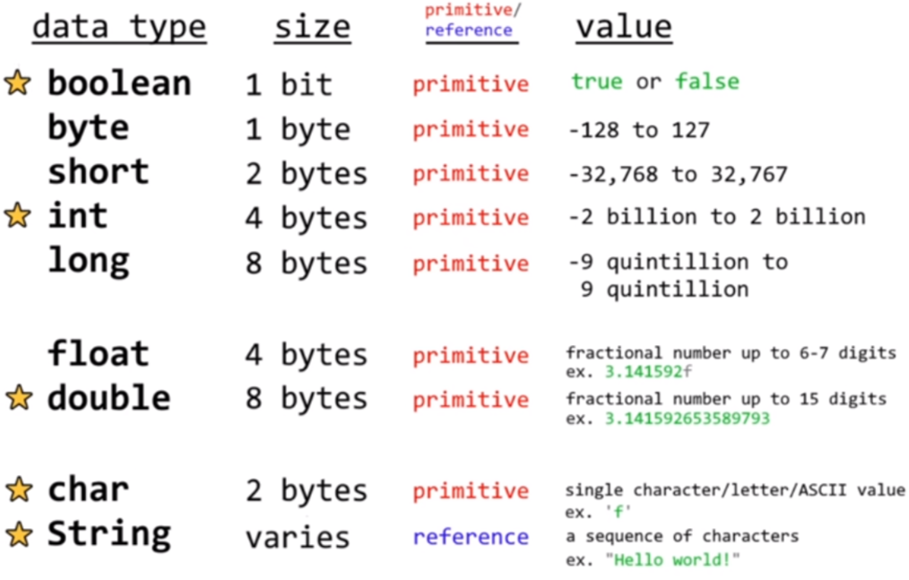
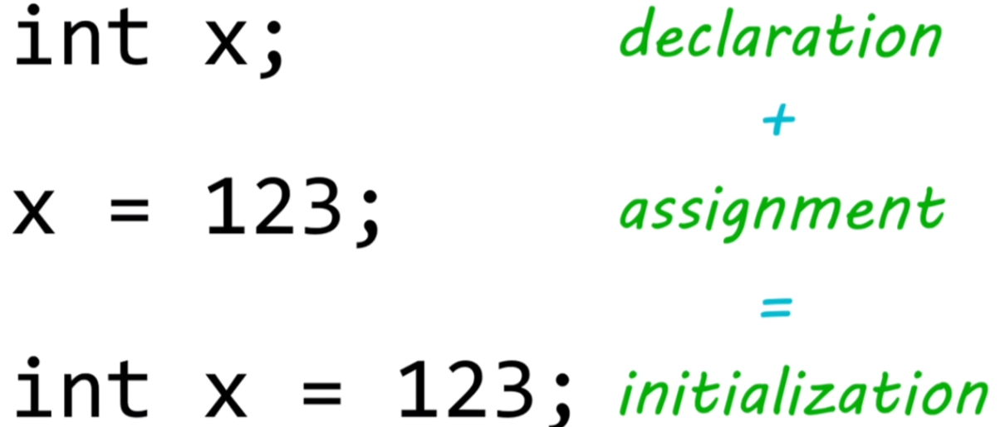

# Variables and Data Structures in Java

## Variables

In Java, variables are categorized based on the data they store and their scope. The main types of variables are:

- **Primitive Variables**: These store primitive data types such as `int`, `float`, `double`, `boolean`, `char`, etc. They hold the actual values.

- **Reference Variables**: These store references (or addresses) to objects in memory. They point to objects created from classes, arrays, or interfaces. They are unlimited (user defined), could hold more than one value, take more memory and actually slowly than primitive variables.

- **Instance Variables (Non-static Fields)**: Declared without the `static` keyword, these variables are unique to each instance of a class. They represent the state of an object.

- **Class Variables (Static Fields)**: Declared with the `static` keyword, these variables are shared among all instances of a class. They represent the state of the class.

### Primitive variables

In Java, primitive types are the most basic data types. They are not objects and hold their values directly in memory. The main primitive types in Java are:

- **byte**: This is an 8-bit signed integer. It has a minimum value of -128 and a maximum value of 127 (inclusive).

- **short**: A 16-bit signed integer, with a minimum value of -32,768 and a maximum value of 32,767.

- **int**: A 32-bit signed integer, with a minimum value of -2^31 and a maximum value of 2^31-1.

- **long**: A 64-bit signed integer, with a minimum value of -2^63 and a maximum value of 2^63-1.

- **float**: A single-precision 32-bit IEEE 754 floating point. It's used to save memory in large arrays of floating point numbers.

- **double**: A double-precision 64-bit IEEE 754 floating point. It's generally used for decimal values, such as currency.

- **boolean**: It has only two possible values: `true` and `false`. It's used for simple flags that track true/false conditions.

- **char**: A single 16-bit Unicode character. It has a minimum value of '\u0000' (or 0) and a maximum value of '\uffff' (or 65,535 inclusive).

### long and float primitive variables assignment

When declaring `long` and `float` variables in Java, there are syntax peculiarities to be aware of:

- **long**: To explicitly declare a variable of type `long`, you append an `L` or `l` to the end of the value. However, using `L` is preferred because `l` can be easily confused with the digit `1`. For example, `long myLong = 123456789L;`.

- **float**: For `float` variables, you must append an `F` or `f` to the end of the value to indicate that the number is a `float` and not a `double` (as `double` is the default type for floating-point numbers in Java). For example, `float myFloat = 12.34F;`.

### Declaration, assignment, initialization

- **Declaration**: `int myNumber;`.

- **Assignment**. After a variable is declared, it can be assigned a value: `myNumber = 5;`.

- **Initialization**. Combines declaration and assignment into a single step: `int myNumber = 5;`.

## Expressions, operands, operators

In Java, expressions are constructs that evaluate to a single value. Expressions are made up of operands and operators:

- **Operands** are the data or variables on which operations are performed.
- **Operators** are symbols that perform operations on operands. Java supports various types of operators, including
  arithmetic (`+`, `-`, `*`, `/`, `%`),
  relational (`<`, `>`, `<=`, `>=`, `==`, `!=`),
  logical (`&&`, `||`, `!`),
  assignment (`=`, `+=`, `-=`, `*=`, `/=`, `%=`), and more.

An expression combines operands and operators according to the syntax of Java to produce another value. For example, in the expression `int result = 10 + 5;`, `10` and `5` are operands, `+` is the operator, and `result` is assigned the value of the expression, which is `15`.

In addition to the operators mentioned, Java also supports the **increment** (`++`) and **decrement** (`--`) operators, which are used to increase or decrease a variable's value by one, respectively. These operators can be used in two forms:

- **Prefix**: When used before the variable (e.g., `++myNumber` or `--myNumber`), the operation is performed, and the value of the expression is the new value of the variable.

- **Postfix**: When used after the variable (e.g., `myNumber++` or `myNumber--`), the original value of the variable is the value of the expression, and then the operation is performed.

## Wrapper Classes

In Java, wrapper classes provide a way to use primitive data types (`int`, `char`, `double`, etc.) as objects. Each primitive data type has a corresponding wrapper class:

- `int` -> `Integer`
- `char` -> `Character`
- `double` -> `Double`
- `boolean` -> `Boolean`
- and so on for `byte`, `short`, `long`, `float`

Wrapper classes are useful for working with collections, such as `ArrayList`, which can only store objects. They also offer utility methods for converting between types, parsing strings, and more. Autoboxing and unboxing automatically convert between primitive types and their corresponding wrapper classes, simplifying their use in Java code.

[Wrapper code](../src/Wrapper.java)

## ArrayList

The `ArrayList` class in Java is a resizable array implementation of the `List` interface. It provides dynamic arrays that can grow as needed, offering flexibility not available with standard arrays. `ArrayList` supports operations such as adding, removing, and searching for elements. It stores its elements as `Object` instances, allowing it to hold any type of objects, including instances of wrapper classes for primitive types. This makes `ArrayList` a versatile choice for storing collections of data where the size may vary dynamically during runtime.

### 2D ArrayList

The `ArrayList` class also supports the creation of 2D arrays, which are essentially `ArrayList` of `ArrayList`s. This allows for the storage of elements of any type, including objects and instances of wrapper classes, making it highly versatile for various programming needs. Additionally, `ArrayList` offers methods to access and modify elements at specific indexes, check the size of the collection, and clear the collection, among others. Its ability to dynamically adjust its size makes it a popular choice for managing collections of data where the number of elements is not known in advance or may change over time.

[Arrays](../src/array_of_objects/Main.java)

## Methods

In the context of programming, particularly in object-oriented languages like Java, methods are blocks of code designed to perform a specific task. A method is associated with an object or a class and can manipulate the **state** (data) of that object or class. Methods are defined within a class and are used to express the **behaviors** of objects. They can take parameters, perform operations or calculations, and return a value.

[Methods](../src/Methods.java)
[Method signature, overloaded methods](../src/MethodSignature.java)

## final Keyword for creating immutable variables

When applied to a variable, it must be initialized at the time of declaration or inside the constructor if it's an instance variable. For methods, marking them as `final` prevents them from being overridden in subclasses, ensuring consistent behavior across different implementations. Similarly, when a class is declared as `final`, it cannot be subclassed, making it a reliable choice for creating immutable and secure classes that maintain their integrity throughout the application lifecycle.
